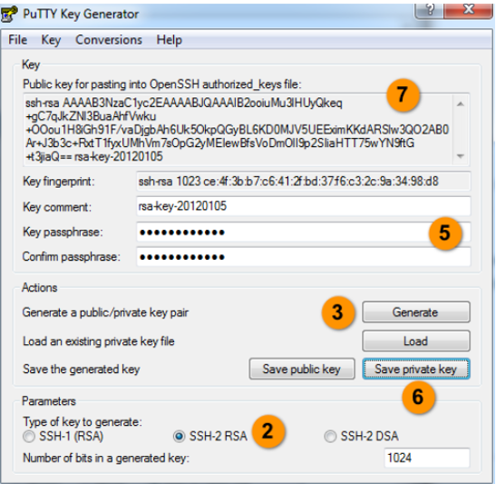

# Create ssh Keys on your local machine
* [Go to Control Panel](#Go-to-Control-Panel)
* [Choose an image](#Choose-an-image)
* [Setup](#Setup)

Linux-Remote Server are Linux-based virtual machines (VMs) that run on top of virtualized hardware
VMs are managed using a terminal and SSH. You’ll need to have an SSH client and, optionally, an SSH key pair. Clients generally authenticate either using passwords (which are less secure and not recommended) or SSH keys (which are very secure and strongly recommended).
We recommend you use SSH keys to connect to your VM.
---
To log in to your VM with SSH, you need three pieces of information:
•	The VM’s IP address
•	The default username on the server
•	Not recommended: The default password for that username, if you aren’t using SSH keys
---
To get your VM’s IP address, visit your Provider Control Panel. The IP address is displayed in the IP Address column after your VM has been created.
The default username is `root` on most operating systems, like Ubuntu and CentOS. Exceptions to this include CoreOS, where you’ll log in as `core`, Rancher, where you’ll log in as `rancher`, and FreeBSD, where you’ll log in as `freebsd`.

OpenSSH is included on Linux, macOS, and Windows Subsystem for Linux.
Windows users with Bash have access to OpenSSH, Windows users without Bash can use PuTTY.
---

## Create ssh Keys on your local machine MacOS/Linux
Run the following command on terminal
```
$ ssh-keygen
```
The utility prompts you to select a location for the keys. 
By default, the keys are stored in the `~/.ssh` directory with the filenames `id_rsa` for the private key and `id_rsa.pub` for the public key. 
Using the default locations allows your SSH client to automatically find your SSH keys when authenticating, so we recommend accepting them by pressing `ENTER`.
!! If you have generated a key previously, you may see the following prompt:
```
Output
/home/username/.ssh/id_rsa already exists.
Overwrite (y/n)?
```
Once you select a location for the key, you’ll be prompted to enter an optional passphrase which encrypts the private key file on disk. We recommend using a passphrase
If you enter one, you will have to provide it every time you use this key, but you can press `ENTER` to bypass this prompt.
This is the last step in the creation process.
You now have a public and private key that you can use to authenticate to your VM.

## Create ssh Keys on your local machine Windows

PuTTY is an SSH client for Windows that you will use to generate your SSH keys.
When you install the PuTTY client, you also install the PuTTYgen utility. PuTTYgen is what you will use to generate your SSH key.
1. Open the PuTTYgen program.
2. For Type of key to generate, select SSH-2 RSA.
3. Click the Generate button.
4. Move your mouse in the area below the progress bar. When the progress bar is full, PuTTYgen generates your key pair.
5. Type a passphrase in the Key passphrase field. Type the same passphrase in the Confirm passphrase field. You can use a key without a passphrase, but this is not recommended.
6. Click the Save private key button to save the private key. Warning! You must save the private key. You will need it to connect to your machine.
7. Right-click in the text field labeled Public key for pasting into OpenSSH authorized_keys file and choose Select All.
8. Right-click again in the same text field and choose Copy.


PuTTY and OpenSSH use different formats of public SSH keys. If the text you pasted in the SSH Key starts with `—— BEGIN SSH2 PUBLIC KEY`, it is in the wrong format. Be sure to follow the instructions carefully. Your key should start with `ssh-rsa AAAA`.
